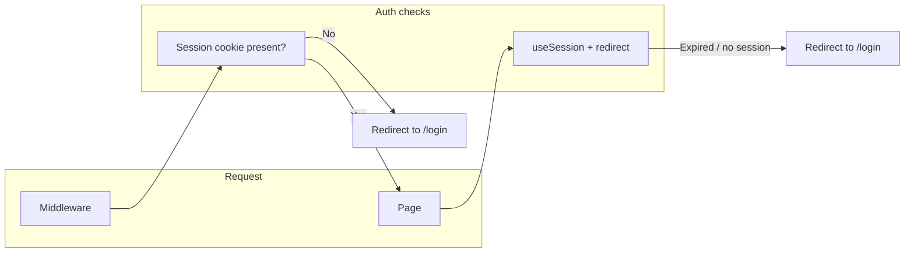

# Imports and Route Protection Plan

## 1. Imports and package alias (corporate-frontend and vendor-frontend)

**Goal:** Use `@corpora/ui` everywhere in app code; no deep `../../../packages/ui/src/...` imports.

### 1.1 Dashboard page imports

- **Corporate-frontend** [apps/corporate-frontend/app/page.tsx](apps/corporate-frontend/app/page.tsx)  
  - Replace:  
  `import { DashboardStatCard } from "../../../packages/ui/src/common-components/stat-cards/dashboard-card";`  
  - With:  
  `import { DashboardStatCard, PrimaryAction, QuickAction, QuickActions } from "@corpora/ui";`  
  - Remove the separate line that already imports `PrimaryAction, QuickAction, QuickActions` from `@corpora/ui` so all four come from a single `@corpora/ui` import.
- **Vendor-frontend** [apps/vendor-frontend/app/page.tsx](apps/vendor-frontend/app/page.tsx)  
  - Same change: single import from `@corpora/ui` for `DashboardStatCard`, `PrimaryAction`, `QuickAction`, `QuickActions`.

### 1.2 Other references (no code changes)

- **globals.css** in both apps: `@source "../../../packages/ui/src/**/*.tsx"` is for Tailwind 4 class scanning, not a component import. Leave as-is unless you move to a shared Tailwind config later.
- **tsconfig.json** `paths`: `"@corpora/ui": ["../../packages/ui/src"]` is correct. The broken `include` line (with comma and extra paths on line 44) can be fixed optionally: move the three `../../packages/...` entries onto separate lines or remove them, since the package is resolved via `paths` and `transpilePackages` in next.config.

**Scope:** Only the two `app/page.tsx` files are changed for imports. No other app files use the deep package path for components.

---

## 2. Route protection: middleware + keep page-level checks

**Goal:** Add middleware to redirect unauthenticated users before they see protected pages, and keep page-level `useSession` + redirect so expired sessions (e.g. cookie expired mid-session) are still handled.

- **Middleware:** First guard. Checks for session cookie on protected paths; if missing, redirect to `/login` (no page render).
- **Page-level:** Second guard. When the cookie expires during use or is invalid, `useSession` sees no session and the existing `useEffect` redirects to `/login`.

### 2.1 Corporate-frontend middleware

- **Add** [apps/corporate-frontend/middleware.ts](apps/corporate-frontend/middleware.ts) at the app root (next to `app/`).
- **Logic:**
  - Use `NextResponse.next()` for public paths: `/login`, `/forgot-password`, `/reset-password`, and Next.js internals (`/_next`, `/favicon.ico`, etc.).
  - For all other paths, check for the better-auth session cookie. Default name: `better-auth.session_token` (per [Better Auth docs](https://www.better-auth.com/docs/concepts/cookies)).
  - If cookie is missing on a protected path: `NextResponse.redirect(new URL('/login', request.url))`.
  - If cookie is present (or path is public): `NextResponse.next()`.
- **Public path list:** e.g. pathname matches `/login`, `/forgot-password`, `/reset-password`, or starts with `/_next` or is `/favicon.ico`. Adjust if you add more public routes (e.g. health check).

### 2.2 Vendor-frontend middleware

- **Add** [apps/vendor-frontend/middleware.ts](apps/vendor-frontend/middleware.ts) with the same structure and rules.
  - Same public routes: `/login`, `/forgot-password`, `/reset-password`, `/_next`, `/favicon.ico`, etc.
  - Same cookie check and redirect to `/login` for protected routes.

### 2.3 Cookie name

- Use `better-auth.session_token` unless your backend overrides it (e.g. `advanced.cookiePrefix` or `advanced.cookies.session_token.name`). If you use a custom name, use that in both middlewares.

### 2.4 Page-level checks (no changes)

- **Keep** the existing pattern on dashboard and other protected pages: `useSession()`, `useEffect` that redirects to `/login` when `!isPending && !session`. This continues to handle:
  - Expired session cookie.
  - Session invalidated on the server.
  - Client-side navigation after expiry.

No removal of page-level auth checks; middleware and page-level checks are complementary.

---

## 3. Implementation order

1. **Imports:** Update [apps/corporate-frontend/app/page.tsx](apps/corporate-frontend/app/page.tsx) and [apps/vendor-frontend/app/page.tsx](apps/vendor-frontend/app/page.tsx) to use the single `@corpora/ui` import.
2. **Middleware:** Add [apps/corporate-frontend/middleware.ts](apps/corporate-frontend/middleware.ts), then [apps/vendor-frontend/middleware.ts](apps/vendor-frontend/middleware.ts), with the same protection rules and cookie name.
3. **Optional:** Clean [apps/corporate-frontend/tsconfig.json](apps/corporate-frontend/tsconfig.json) and [apps/vendor-frontend/tsconfig.json](apps/vendor-frontend/tsconfig.json) `include` array (fix the malformed line 44) so it’s valid JSON and doesn’t reference individual package files.

---

## 4. Summary

| Area             | Corporate-frontend                                      | Vendor-frontend        |
| ---------------- | ------------------------------------------------------- | ---------------------- |
| Dashboard import | Single `@corpora/ui` import in `app/page.tsx`           | Same in `app/page.tsx` |
| Middleware       | New `middleware.ts`: cookie check, redirect to `/login` | Same                   |
| Page-level auth  | Keep `useSession` + redirect on protected pages         | Keep as-is             |

No changes to `globals.css` or to existing page-level auth logic; only additive middleware and import fixes.